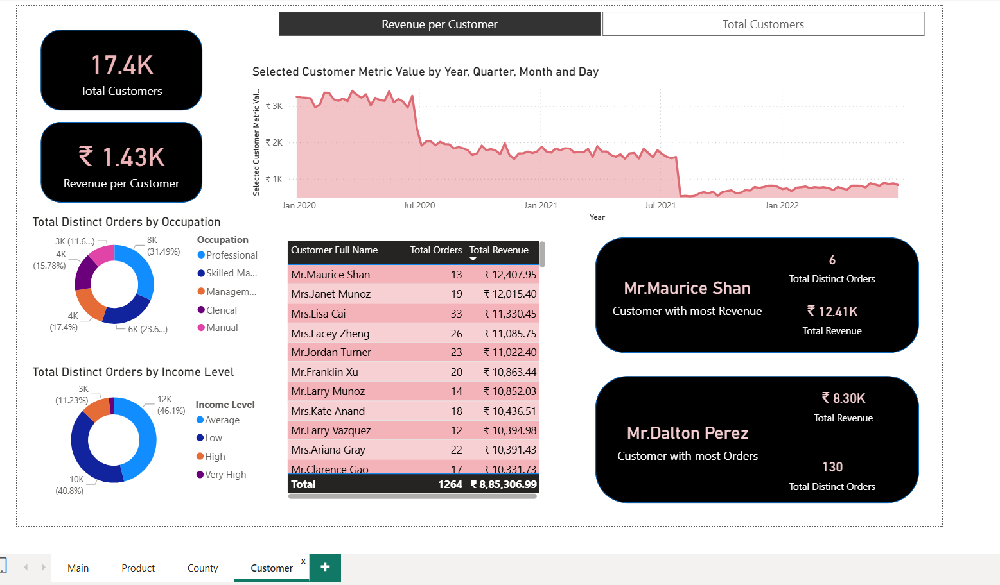
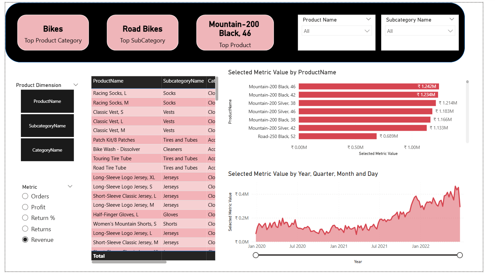
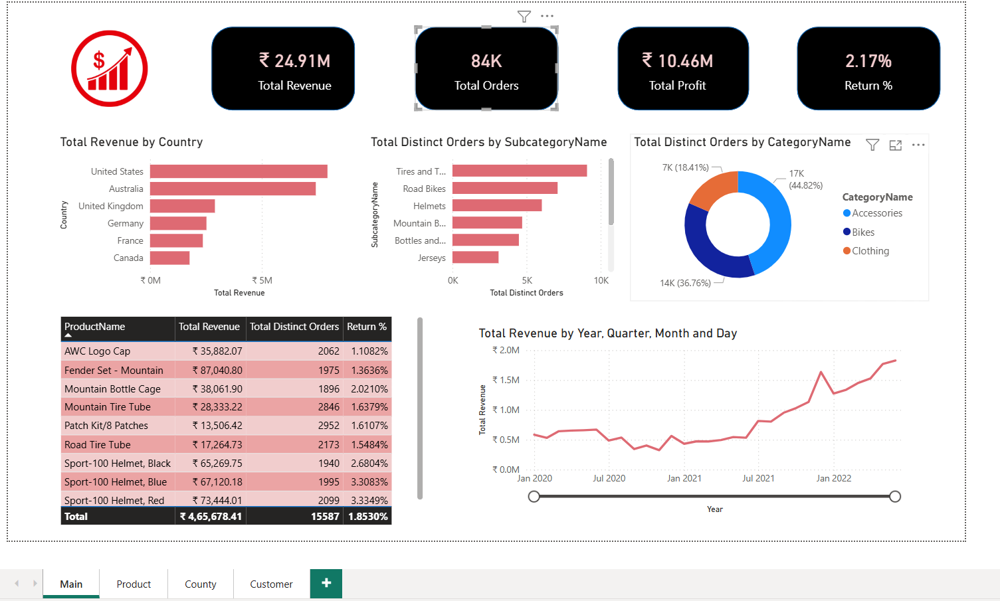

# Power BI Data Analysis Dashboard

## Overview

This project presents a comprehensive Power BI dashboard designed for data analysis, leveraging multiple data sources to provide actionable insights for business stakeholders. The dashboard integrates various datasets, including Sales, Customers, Products, and Product Categories, and offers multiple analytical perspectives through interactive visualizations.

## Data Sources

- **Sales**: Transactional sales data
- **Customers**: Customer demographic and profile information
- **Product**: Product details and attributes
- **Product Category**: Hierarchical categorization of products

## Data Model

The Power BI data model is structured using a star schema, with the Sales table as the fact table and Customers, Product, and Product Category as lookup (dimension) tables. Relationships are established in the Model View to enable seamless data exploration and accurate metric calculations.

## Metrics & Calculations

Key business metrics are calculated using DAX (Data Analysis Expressions), including but not limited to:
- Total Sales
- Sales by Region
- Sales by Product Category
- Customer Count
- Time-based trends and comparisons

## Dashboard Features

The dashboard is organized into multiple report pages, each providing a unique analytical view:
- **Customer View**: Insights into customer demographics, behavior, and sales contribution.
- **Region View**: Regional sales performance, trends, and comparisons.
- **Product View**: Product-level analysis, category breakdowns, and performance metrics.

## Visualizations

A variety of Power BI visuals are used to present the data effectively:
- **Bar Charts**: For comparing sales and other metrics across categories.
- **Card Visuals**: To highlight key KPIs.
- **Pie Charts**: For proportional breakdowns.
- **Time Series Graphs**: To analyze trends over time.
- **Slicers & Filters**: For interactive data exploration and custom views.

## How to Use

1. **Clone this repository** to your local machine.
2. **Open the Power BI (.pbix) file** in Power BI Desktop.
3. **Connect or update data sources** as needed.
4. **Explore the dashboard** using the provided visuals, slicers, and filters.

## Screenshots

### Customer View

### Region View

### Product View

### Main View

